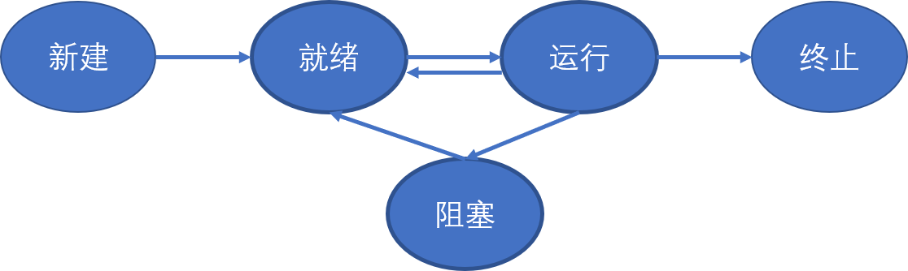

## 概述

用户使用计算机就是启动一堆进程，用户管理计算机就是管理这一堆进程。

## 多进程的组织：PCB + 队列 + 状态

### PCB

操作系统是使用PCB来感知进程的。PCB存储了进程的信息和各种状态。

### 状态

内存中的进程有三个状态，分别是进行中、排队等待中、等待事件中。其中对于排队等待中和等待事件中的进程，操作系统都是将其PCB创建一个队列进行管理的。

进程的状态转移图如下图所示：

### 队列

阻塞态和就绪态的进程都是使用队列来管理进程的PCB。

## 多进程引发的问题

### 多进程在内存中互相影响

两个不同的进程可能会对同一块地址进行写操作，进而造成进程的崩溃。

为了解决这个问题，引入了多进程的地址空间分离，即内存管理。将不同内存操作的内存地址映射到不同的内存区域。例如，进程1访问地址为100的内存，最终映射到了地址为780的区域；而进程2访问地址为100的内存是则会被映射到地址为1260的内存区域。从而避免了不同进程之间的互相影响。

`进程管理+内存管理=多进程映像`

### 多进程的合作

多个进程同时向打印机的缓冲队列中同一块区域写入数据，可能会造成冲突。这个问题类似于生产者和消费者问题。

多个进程同时进行写操作，可能会造成意想不到的结果。例如起始时资源数量为5，两个进程同时分别进行生产和消费，则最终可能的资源数为4或6，最终导致进程崩溃。

为了解决这个问题，在准备写时，需要首先检查指定资源是否被上锁，如果被上锁要等到锁被释放，否则首先对资源上锁，之后再进行写操作。