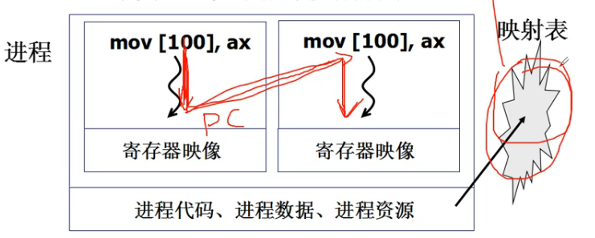
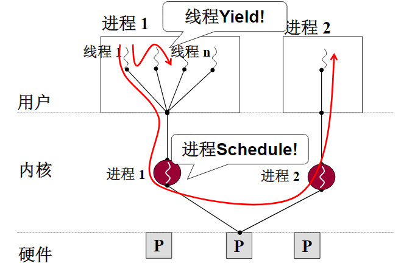

## 概述

进程 = 资源 + 指令执行序列

如上图所示,线程在切换的时候只改变PC的值和寄存器影响,不会改变进程代码、进程数据、进程资源等。即映射表也不会切换。

`线程`：保留了并发的优点，避免了进程切换的代价。

## 多线程共享地址空间

浏览器启动多个线程。

其中获取文本的线程和显示文本的线程将会共享存储文本的内存区域。

## 每个线程应该分别创建一个栈

多线程中每个线程应该分别创建一个栈。栈内存储了各级调用要执行的下一条指令所在的地址。

在进行进程切换的过程中要先进行栈的切换。

创建线程需要分别创建TCB、栈，将程序的起始地址压入栈中。

## 用户级线程与内核级线程

用户级线程虽然创建了多个线程，但是所有线程只对应一个进程调度。如果一个线程一直占用该进程的资源，那么该进程中的其他的线程也不能得到执行。

而内核级线程中每个线程在内核中对应不同的核心，一个线程在占用资源的时候仍然可以调用该线程下的其他线程。