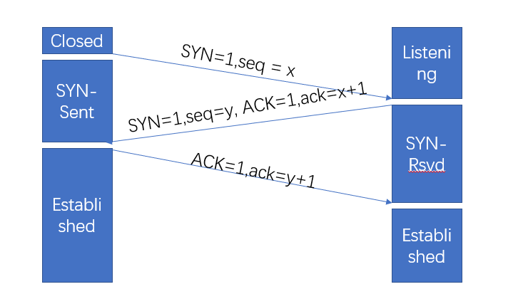
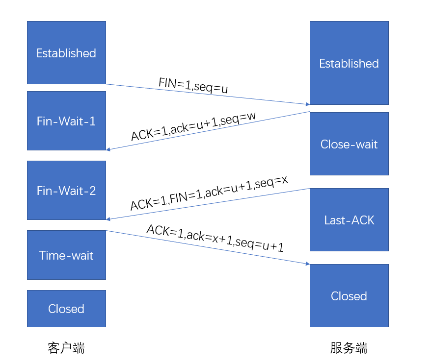

## 五层协议

### 物理层

解决两台物理机的通信问题,保证一台物理机向另一台物理机发送比特流,后者可以收到这些比特流

### 数据链路层

解决比特流传输中错传和数据的不完整等问题,将要传输的数据进行格式化

### 网络层

传输数据的过程中如何找目标节点以及到达目标节点的最佳路径

### 传输层

传输层向上层用户传输高效的、可靠的、成本有效的数据传输服务

### 应用层

使网络通信更加方便

## TCP的3次握手

### 过程

- 起初客户端处于关闭状态，服务端处于监听状态
- 第一次握手：客户端向服务端发送SYN包(seq=x)，并进入SYN_SEND状态等待服务端确认
- 第二次握手：服务端收SYN包，需要发送ACK包，同时，自己需要发送一个SYN包(seq=y)，即SYN+ACK包，之后服务端进入SYN_RSCV状态
- 第三次握手：客户端收到ACK+SYN包，需要向服务端发送ACK包，之后进入Established状态，服务端在收到ACK包之后也进入Established状态。三次握手完成。

### 原因

- 初始化Sequence Number的值
- 避免超时的连接请求到达服务器，使服务器尝试建立错误的连接。

## TCP的4次挥手

### 过程

- 起初客户端和服务端都处于Established阶段
- 第一次挥手: 客户端向服务端发送FIN包(seq=u),关闭客户端向服务端的数据传送,进入fin-wait-1状态
- 第二次挥手: 服务端向客户端回复ACK包(ack=u+1),进入Close-wait状态,同时继续正常发送数据包
- 第三次挥手: 服务端将所有数据发送完毕之后,再次发送ACK包(ack=u+1),同时发送FIN包(seq=x)告诉客户端数据已发送完毕,之后进入Last-ack状态
- 第四次挥手: 客户端向服务端回复ACK包(ack=x+1),之后进入time-wait状态,等待2个MSL之后进入Close状态.服务端在收到ACK包之后直接进入Close状态

### 客户端最后等待2MSL的原因

`确保有足够的时间让服务端收到ACK包`

第四次握手消息发出,一个MSL之后如果服务端仍没有收到ACK包,将会重发一个FIN包,该包需要MSL才能到达客户端,因此客户端需要2MSL的时间之后才能close.

### 为什么需要四次挥手

- TCP是全双工的,各方都需要发送和接受FIN和ACK
- 需要保证服务端的数据发送完毕.